# Database ERD v1

> **⚠ Superseded historical design document.** This ERD is a
> pre-implementation draft and does not match the schema actually
> built in `supabase/migrations/` (`0001`–`0042`, merged). It is kept
> for historical reference only and is not maintained against the
> implemented schema. For the current, implemented database design,
> see [`docs/ARCHITECTURE.md`](../ARCHITECTURE.md) and
> [`docs/MIGRATION_INDEX.md`](../MIGRATION_INDEX.md).

## Document Information

| Field              | Value                                    |
| ------------------ | ---------------------------------------- |
| Project            | Credit Card Intelligence Platform (CCIP) |
| Document           | Database Entity Relationship Diagram     |
| Version            | 1.0                                      |
| Status             | Draft                                    |
| Architecture Scope | Recommendation Engine MVP                |
| Database Target    | PostgreSQL / Supabase                    |

---

# 1. Purpose

This document defines the first logical Entity Relationship Diagram for the Credit Card Intelligence Platform.

It connects the database entities required to support the Recommendation Engine MVP.

The ERD defines:

* Core entities
* Reference entities
* Primary keys
* Foreign keys
* Relationship cardinality
* Required and optional relationships
* Recommended database creation order
* MVP boundaries
* Deferred entities

This document is the main database relationship reference before PostgreSQL schema implementation begins.

---

# 2. MVP Database Scope

The Recommendation Engine MVP requires the following entities.

## Core Business Entities

```text
cards
reward_rules
reward_rule_targets
reward_rule_exclusions
```

## Classification Entities

```text
spending_categories
mcc_categories
```

## Reference Entities

```text
banks
countries
currencies
card_types
card_levels
card_networks
loyalty_programs
```

---

# 3. Logical Architecture

```text
Country
├── Banks
└── Currencies

Bank
└── Cards

Card
├── Card Type
├── Card Level
├── Card Network
├── Currency
├── Primary Loyalty Program
└── Reward Rules

Reward Rule
├── Loyalty Program
├── Currency
├── Reward Rule Targets
└── Reward Rule Exclusions

Spending Category
├── Child Spending Categories
└── MCC Categories

Reward Rule Target
├── Spending Category
└── MCC Category

Reward Rule Exclusion
├── Spending Category
└── MCC Category
```

---

# 4. Mermaid ERD

```mermaid
erDiagram

    COUNTRIES {
        uuid id PK
        text code UK
        text slug UK
        text name_en
        text name_ar
        boolean is_active
        timestamp created_at
        timestamp updated_at
    }

    CURRENCIES {
        uuid id PK
        text code UK
        text name_en
        text name_ar
        text symbol_en
        text symbol_ar
        integer decimal_places
        boolean is_active
        timestamp created_at
        timestamp updated_at
    }

    BANKS {
        uuid id PK
        text code UK
        text slug UK
        uuid country_id FK
        text name_en
        text name_ar
        text short_name
        text website_url
        text customer_service_phone
        text logo_url
        boolean is_active
        date effective_from
        timestamp last_verified_at
        timestamp created_at
        timestamp updated_at
    }

    CARD_TYPES {
        uuid id PK
        text code UK
        text slug UK
        text name_en
        text name_ar
        text description_en
        text description_ar
        boolean is_active
        timestamp created_at
        timestamp updated_at
    }

    CARD_LEVELS {
        uuid id PK
        text code UK
        text slug UK
        text name_en
        text name_ar
        integer rank_order
        boolean is_active
        timestamp created_at
        timestamp updated_at
    }

    CARD_NETWORKS {
        uuid id PK
        text code UK
        text slug UK
        text name_en
        text name_ar
        text website_url
        text logo_url
        boolean is_active
        timestamp created_at
        timestamp updated_at
    }

    LOYALTY_PROGRAMS {
        uuid id PK
        text code UK
        text slug UK
        uuid owner_bank_id FK
        uuid valuation_currency_id FK
        text program_type
        text name_en
        text name_ar
        decimal reference_unit_value
        text website_url
        boolean is_active
        date effective_from
        timestamp last_verified_at
        timestamp created_at
        timestamp updated_at
    }

    CARDS {
        uuid id PK
        text code UK
        text slug UK
        uuid bank_id FK
        uuid card_type_id FK
        uuid card_level_id FK
        uuid card_network_id FK
        uuid primary_loyalty_program_id FK
        uuid currency_id FK
        text name_en
        text name_ar
        text short_name_en
        text short_name_ar
        text description_en
        text description_ar
        text application_url
        text image_url
        text target_user_type
        text availability_status
        boolean is_active
        boolean is_public
        boolean is_recommendation_eligible
        date effective_from
        timestamp last_verified_at
        timestamp created_at
        timestamp updated_at
    }

    SPENDING_CATEGORIES {
        uuid id PK
        text code UK
        text slug UK
        uuid parent_category_id FK
        text name_en
        text name_ar
        text description_en
        text description_ar
        integer display_order
        text icon_key
        boolean is_active
        boolean is_user_selectable
        timestamp created_at
        timestamp updated_at
    }

    MCC_CATEGORIES {
        uuid id PK
        text code UK
        text slug UK
        uuid spending_category_id FK
        text name_en
        text name_ar
        text description_en
        text description_ar
        text network_reference
        text source_url
        boolean is_financial_transaction
        boolean is_cash_like
        boolean is_government
        boolean is_commonly_excluded
        boolean is_active
        date effective_from
        timestamp last_verified_at
        timestamp created_at
        timestamp updated_at
    }

    REWARD_RULES {
        uuid id PK
        text code UK
        uuid card_id FK
        uuid loyalty_program_id FK
        uuid currency_id FK
        text reward_type
        text calculation_method
        decimal reward_rate
        decimal spend_unit
        decimal minimum_transaction_amount
        decimal minimum_period_spend
        text minimum_spend_period
        decimal maximum_reward_amount
        decimal maximum_eligible_spend
        text cap_period
        text rounding_method
        integer priority
        boolean is_base_rule
        boolean is_promotional
        boolean is_active
        date effective_from
        date effective_to
        timestamp last_verified_at
        text source_url
        text source_reference
        text notes_en
        text notes_ar
        timestamp created_at
        timestamp updated_at
    }

    REWARD_RULE_TARGETS {
        uuid id PK
        uuid reward_rule_id FK
        text target_type
        uuid spending_category_id FK
        uuid mcc_category_id FK
        timestamp created_at
    }

    REWARD_RULE_EXCLUSIONS {
        uuid id PK
        uuid reward_rule_id FK
        text exclusion_type
        uuid spending_category_id FK
        uuid mcc_category_id FK
        text exclusion_code
        text reason_en
        text reason_ar
        timestamp created_at
    }

    COUNTRIES ||--o{ BANKS : contains

    BANKS ||--o{ CARDS : issues
    BANKS ||--o{ LOYALTY_PROGRAMS : owns

    CURRENCIES ||--o{ CARDS : denominates
    CURRENCIES ||--o{ REWARD_RULES : measures
    CURRENCIES ||--o{ LOYALTY_PROGRAMS : values

    CARD_TYPES ||--o{ CARDS : classifies
    CARD_LEVELS ||--o{ CARDS : assigns
    CARD_NETWORKS ||--o{ CARDS : operates

    LOYALTY_PROGRAMS ||--o{ CARDS : primary_program
    LOYALTY_PROGRAMS ||--o{ REWARD_RULES : credits

    CARDS ||--o{ REWARD_RULES : defines

    SPENDING_CATEGORIES ||--o{ SPENDING_CATEGORIES : parent_of
    SPENDING_CATEGORIES ||--o{ MCC_CATEGORIES : groups

    REWARD_RULES ||--o{ REWARD_RULE_TARGETS : targets
    REWARD_RULES ||--o{ REWARD_RULE_EXCLUSIONS : excludes

    SPENDING_CATEGORIES ||--o{ REWARD_RULE_TARGETS : targeted_by
    MCC_CATEGORIES ||--o{ REWARD_RULE_TARGETS : targeted_by

    SPENDING_CATEGORIES ||--o{ REWARD_RULE_EXCLUSIONS : excluded_by
    MCC_CATEGORIES ||--o{ REWARD_RULE_EXCLUSIONS : excluded_by
```



---

# 5. Relationship Summary

| Parent Entity         | Child Entity             | Relationship               | Required on Child |
| --------------------- | ------------------------ | -------------------------- | ----------------: |
| `countries`           | `banks`                  | One-to-many                |               Yes |
| `banks`               | `cards`                  | One-to-many                |               Yes |
| `banks`               | `loyalty_programs`       | One-to-many                |                No |
| `currencies`          | `cards`                  | One-to-many                |               Yes |
| `currencies`          | `reward_rules`           | One-to-many                |               Yes |
| `currencies`          | `loyalty_programs`       | One-to-many                |               Yes |
| `card_types`          | `cards`                  | One-to-many                |               Yes |
| `card_levels`         | `cards`                  | One-to-many                |                No |
| `card_networks`       | `cards`                  | One-to-many                |               Yes |
| `loyalty_programs`    | `cards`                  | One-to-many                |                No |
| `loyalty_programs`    | `reward_rules`           | One-to-many                |                No |
| `cards`               | `reward_rules`           | One-to-many                |               Yes |
| `spending_categories` | `spending_categories`    | Self-referencing hierarchy |                No |
| `spending_categories` | `mcc_categories`         | One-to-many                |               Yes |
| `reward_rules`        | `reward_rule_targets`    | One-to-many                |               Yes |
| `reward_rules`        | `reward_rule_exclusions` | One-to-many                |               Yes |
| `spending_categories` | `reward_rule_targets`    | One-to-many                |       Conditional |
| `mcc_categories`      | `reward_rule_targets`    | One-to-many                |       Conditional |
| `spending_categories` | `reward_rule_exclusions` | One-to-many                |       Conditional |
| `mcc_categories`      | `reward_rule_exclusions` | One-to-many                |       Conditional |

---

# 6. Entity Responsibilities

## Countries

Table:

```text
countries
```

Purpose:

* Provides country-level reference data.
* Supports multi-country expansion.
* Prevents country names and codes from being duplicated across business entities.

Examples:

```text
SA
AE
BH
KW
```

The MVP initially requires:

```text
Saudi Arabia
```

---

## Currencies

Table:

```text
currencies
```

Purpose:

* Defines monetary units.
* Supports card currencies.
* Supports reward-rule thresholds and caps.
* Supports loyalty-program valuations.

Examples:

```text
SAR
AED
USD
KWD
BHD
```

Currency exchange rates are not included in ERD v1.

---

## Banks

Table:

```text
banks
```

Purpose:

* Represents card issuers and financial institutions.
* Owns issued cards.
* May own loyalty programs.

Each bank belongs to one country.

---

## Card Types

Table:

```text
card_types
```

Purpose:

Classifies the functional card type.

Examples:

```text
CREDIT
CHARGE
DEBIT
PREPAID
```

The MVP primarily uses:

```text
CREDIT
```

---

## Card Levels

Table:

```text
card_levels
```

Purpose:

Stores card product tiers.

Examples:

```text
CLASSIC
GOLD
PLATINUM
SIGNATURE
INFINITE
WORLD
WORLD_ELITE
```

The relationship is optional because some card products do not have a recognized level.

---

## Card Networks

Table:

```text
card_networks
```

Purpose:

Stores the payment network associated with a card.

Examples:

```text
VISA
MASTERCARD
AMERICAN_EXPRESS
MADA
```

Each card has exactly one network in ERD v1.

---

## Loyalty Programs

Table:

```text
loyalty_programs
```

Purpose:

* Represents points, miles, or cashback programs.
* Stores the fixed reference monetary value used by the Recommendation Engine.
* May be owned by a bank.
* May be used by multiple cards.

Examples:

```text
ALFURSAN
MOKAFAA
LAK
AJWAA
BANK_CASHBACK
```

The `owner_bank_id` relationship is optional because some loyalty programs are operated by external airlines, hotels, or independent partners.

---

## Cards

Table:

```text
cards
```

Purpose:

Represents one specifically issued card variant.

Each card belongs to:

* One bank
* One card type
* One card network
* One currency

A card may belong to:

* One card level
* One primary loyalty program

Each meaningful product variant is stored separately.

---

## Spending Categories

Table:

```text
spending_categories
```

Purpose:

Provides user-friendly spending classifications.

Examples:

```text
DINING
GROCERIES
FUEL
TRAVEL
AIRLINES
HOTELS
GENERAL
```

The table supports parent-child hierarchy through:

```text
parent_category_id
```

---

## MCC Categories

Table:

```text
mcc_categories
```

Purpose:

Stores individual Merchant Category Codes and maps each MCC to one primary spending category.

Example:

```text
5812 → DINING
5411 → GROCERIES
5541 → FUEL
```

MCC codes must be stored as four-character text values.

---

## Reward Rules

Table:

```text
reward_rules
```

Purpose:

Stores one independent earning rule for one card.

Examples:

```text
3 points per SAR on dining
1 mile per 5 SAR on general spending
5% cashback on groceries
```

Each rule belongs to exactly one card.

---

## Reward Rule Targets

Table:

```text
reward_rule_targets
```

Purpose:

Defines where a reward rule applies.

A target may represent:

* General eligible spending
* A spending category
* A specific MCC

Each reward rule must have at least one target.

---

## Reward Rule Exclusions

Table:

```text
reward_rule_exclusions
```

Purpose:

Defines transactions excluded from a reward rule.

An exclusion may reference:

* A spending category
* A specific MCC
* A controlled exclusion type

A reward rule may have zero or many exclusions.

---

# 7. Primary Keys

All primary business and reference entities use:

```text
UUID
```

Primary key field:

```text
id
```

Recommended PostgreSQL generation:

```sql
gen_random_uuid()
```

UUID values are internal identifiers.

They must not be exposed as the primary public URL identifiers when a slug is available.

---

# 8. Business Identifiers

Major reference and business entities should use a stable business code.

Examples:

```text
banks.code
cards.code
currencies.code
card_types.code
card_levels.code
card_networks.code
loyalty_programs.code
spending_categories.code
mcc_categories.code
reward_rules.code
```

Business codes must:

* Be unique
* Be stable
* Use uppercase snake case where applicable
* Remain unchanged when display names change

Example:

```text
ALRAJHI_ALFURSAN_VISA_INFINITE
```

---

# 9. Slugs

Public-facing entities should use URL-friendly slugs.

Entities with slugs:

```text
countries
banks
currencies
card_types
card_levels
card_networks
loyalty_programs
cards
spending_categories
mcc_categories
```

Example:

```text
al-rajhi-alfursan-visa-infinite
```

Reward rules do not require public slugs in MVP.

---

# 10. Foreign Key Behavior

Recommended foreign-key deletion behavior is conservative.

## Restrict Deletion

Use restrictive deletion behavior for reference data that is already in use.

Examples:

```text
banks
currencies
card_types
card_levels
card_networks
loyalty_programs
spending_categories
mcc_categories
```

Recommended behavior:

```text
ON DELETE RESTRICT
```

Historical or inactive reference rows should normally be deactivated rather than deleted.

---

## Cascade Deletion

Dependent records that have no independent meaning may use cascading deletion.

Examples:

```text
reward_rule_targets
reward_rule_exclusions
```

Recommended behavior:

```text
reward_rule_targets.reward_rule_id
ON DELETE CASCADE

reward_rule_exclusions.reward_rule_id
ON DELETE CASCADE
```

Deleting cards and reward rules should be restricted in production workflows.

Soft deactivation is preferred over deletion.

---

## Set Null

Optional descriptive relationships may use:

```text
ON DELETE SET NULL
```

Potential cases:

```text
cards.card_level_id
cards.primary_loyalty_program_id
loyalty_programs.owner_bank_id
```

However, production deletion of referenced records should remain rare.

---

# 11. Required Relationship Rules

## Cards

A card cannot exist without:

```text
bank_id
card_type_id
card_network_id
currency_id
```

A card may exist without:

```text
card_level_id
primary_loyalty_program_id
```

---

## Reward Rules

A reward rule cannot exist without:

```text
card_id
currency_id
reward_type
calculation_method
reward_rate
spend_unit
```

A points or miles rule should normally include:

```text
loyalty_program_id
```

A cashback rule may omit the loyalty program relationship.

---

## MCC Categories

An MCC record cannot exist without:

```text
spending_category_id
```

Every MCC must map to exactly one primary spending category in ERD v1.

---

# 12. Conditional Constraints

Some constraints require cross-field validation.

## Reward Rule Targets

Exactly one target configuration must be valid.

### General

```text
target_type = GENERAL
spending_category_id IS NULL
mcc_category_id IS NULL
```

### Spending Category

```text
target_type = SPENDING_CATEGORY
spending_category_id IS NOT NULL
mcc_category_id IS NULL
```

### MCC

```text
target_type = MCC
spending_category_id IS NULL
mcc_category_id IS NOT NULL
```

---

## Reward Rule Exclusions

Exclusion data must match the selected exclusion type.

Examples:

### Category Exclusion

```text
exclusion_type = SPENDING_CATEGORY
spending_category_id IS NOT NULL
mcc_category_id IS NULL
```

### MCC Exclusion

```text
exclusion_type = MCC
spending_category_id IS NULL
mcc_category_id IS NOT NULL
```

### Managed Exclusion

```text
exclusion_type IN (
    CASH_LIKE,
    GOVERNMENT,
    FEES,
    REFUNDS,
    OTHER
)
```

These may use:

```text
exclusion_code
```

---

# 13. Uniqueness Constraints

Recommended unique constraints:

```text
countries.code
countries.slug

currencies.code

banks.code
banks.slug

card_types.code
card_types.slug

card_levels.code
card_levels.slug

card_networks.code
card_networks.slug

loyalty_programs.code
loyalty_programs.slug

cards.code
cards.slug

spending_categories.code
spending_categories.slug

mcc_categories.code
mcc_categories.slug

reward_rules.code
```

---

## Reward Rule Target Uniqueness

Duplicate targets for the same reward rule must be prevented.

Recommended partial uniqueness logic:

```text
reward_rule_id + target_type + spending_category_id
```

and:

```text
reward_rule_id + target_type + mcc_category_id
```

General targets should allow only one target per reward rule.

---

## Reward Rule Exclusion Uniqueness

Duplicate exclusions for one reward rule must be prevented where possible.

Examples:

```text
reward_rule_id + exclusion_type + spending_category_id
```

```text
reward_rule_id + exclusion_type + mcc_category_id
```

```text
reward_rule_id + exclusion_type + exclusion_code
```

---

# 14. Recommended Indexes

## Cards

```text
cards.bank_id
cards.card_type_id
cards.card_level_id
cards.card_network_id
cards.primary_loyalty_program_id
cards.currency_id
cards.availability_status
cards.is_active
cards.is_public
cards.is_recommendation_eligible
```

Recommended composite index:

```text
is_active
is_public
is_recommendation_eligible
availability_status
```

Purpose:

Quickly load eligible recommendation candidates.

---

## Reward Rules

```text
reward_rules.card_id
reward_rules.loyalty_program_id
reward_rules.currency_id
reward_rules.is_active
reward_rules.effective_from
reward_rules.effective_to
reward_rules.priority
```

Recommended composite index:

```text
card_id
is_active
effective_from
effective_to
```

---

## Reward Rule Targets

```text
reward_rule_targets.reward_rule_id
reward_rule_targets.target_type
reward_rule_targets.spending_category_id
reward_rule_targets.mcc_category_id
```

---

## Reward Rule Exclusions

```text
reward_rule_exclusions.reward_rule_id
reward_rule_exclusions.exclusion_type
reward_rule_exclusions.spending_category_id
reward_rule_exclusions.mcc_category_id
```

---

## Spending and MCC Categories

```text
spending_categories.parent_category_id
spending_categories.is_active
spending_categories.is_user_selectable

mcc_categories.spending_category_id
mcc_categories.is_active
mcc_categories.is_cash_like
mcc_categories.is_government
mcc_categories.is_commonly_excluded
```

---

# 15. Recommended Database Creation Order

Tables must be created in dependency order.

## Phase 1 — Independent Reference Tables

```text
1. countries
2. currencies
3. card_types
4. card_levels
5. card_networks
6. spending_categories
```

---

## Phase 2 — Reference Tables with Dependencies

```text
7. banks
8. loyalty_programs
9. mcc_categories
```

Dependencies:

```text
banks → countries

loyalty_programs → banks
loyalty_programs → currencies

mcc_categories → spending_categories
```

---

## Phase 3 — Core Card Tables

```text
10. cards
```

Dependencies:

```text
cards → banks
cards → card_types
cards → card_levels
cards → card_networks
cards → loyalty_programs
cards → currencies
```

---

## Phase 4 — Reward Engine Tables

```text
11. reward_rules
12. reward_rule_targets
13. reward_rule_exclusions
```

Dependencies:

```text
reward_rules → cards
reward_rules → loyalty_programs
reward_rules → currencies

reward_rule_targets → reward_rules
reward_rule_targets → spending_categories
reward_rule_targets → mcc_categories

reward_rule_exclusions → reward_rules
reward_rule_exclusions → spending_categories
reward_rule_exclusions → mcc_categories
```

---

# 16. Recommended Seed Data Order

After schema creation, seed data should be inserted in the following order:

```text
1. Countries
2. Currencies
3. Card Types
4. Card Levels
5. Card Networks
6. Spending Categories
7. Banks
8. Loyalty Programs
9. MCC Categories
10. Cards
11. Reward Rules
12. Reward Rule Targets
13. Reward Rule Exclusions
```

This avoids foreign-key failures during initial data population.

---

# 17. Recommendation Engine Query Path

The primary data-loading path is:

```text
cards
↓
reward_rules
↓
reward_rule_targets
↓
spending_categories / mcc_categories
↓
reward_rule_exclusions
↓
loyalty_programs
↓
currencies
```

Candidate-card filtering starts from:

```text
cards.is_active = true
cards.is_public = true
cards.is_recommendation_eligible = true
cards.availability_status = AVAILABLE
```

The engine then loads active reward rules associated with each eligible card.

---

# 18. Example Relationship Walkthrough

Example card:

```text
Al Rajhi AlFursan Visa Infinite
```

Relationships:

```text
Country:
Saudi Arabia

Bank:
Al Rajhi Bank

Card Type:
Credit

Card Level:
Infinite

Card Network:
Visa

Currency:
SAR

Primary Loyalty Program:
AlFursan

Reward Rules:
Dining Miles Rule
Travel Miles Rule
General Miles Rule
```

Example dining rule:

```text
Card
└── Reward Rule
    ├── Reward Type: MILES
    ├── Rate: 3
    ├── Spend Unit: 1 SAR
    ├── Target Type: SPENDING_CATEGORY
    ├── Target: DINING
    └── Loyalty Program: ALFURSAN
```

Value calculation:

```text
Dining Spend
↓
Dining Reward Rule
↓
Miles Quantity
↓
AlFursan Reference Unit Value
↓
Estimated SAR Reward Value
```

---

# 19. Data Integrity Principles

The database must follow these principles:

## Structured Data Over Free Text

Reward rates, caps, categories, and exclusions must use structured fields.

Free-text notes are supplementary only.

---

## Deactivation Over Deletion

Records that have been used in production should normally be deactivated.

Examples:

```text
is_active = false
availability_status = DISCONTINUED
```

---

## Source Traceability

Cards, MCC classifications, loyalty valuations, and reward rules should include verification metadata where applicable.

Recommended fields:

```text
effective_from
last_verified_at
source_url
source_reference
```

---

## Deterministic Recommendations

The same database state and user input must always return the same recommendation result.

No random ranking behavior is permitted.

---

# 20. Known Architecture Decisions Reflected in ERD v1

This ERD reflects the following approved decisions:

```text
BANK-001
Multi-country ready

DB-001
UUID + Business Code + Slug

DB-002
Card Level as an independent entity

DB-003
Card Network as an independent entity

DB-004
One primary loyalty program per card

DB-005
Card Type as an independent entity

DB-006
Each issued card variant is a separate record

DB-007
Current-state model with effective_from and last_verified_at

DB-008
Fees stored in a separate future table

DB-009
Currency as an independent entity

CARD-001
Target user type stored as metadata

ARCH-001
Recommendation Engine MVP tables prioritized first
```

---

# 21. Deferred Entities

The following entities are not included in ERD v1.

```text
fees
fee_types

benefits
benefit_types

offers
offer_categories

merchants
merchant_locations

card_programs

reward_rule_tiers

mcc_groups
mcc_group_members

user_profiles
user_spending_profiles
user_spending_items
user_cards

recommendation_runs
recommendation_results

exchange_rates

data_sources
verification_logs
```

These entities may be added in later ERD versions.

---

# 22. Important MVP Limitation

Although annual fees are required by the Recommendation Engine net-value formula, the detailed `fees` entity is deferred from the first logical slice.

Until the fees table is implemented, annual fee handling must use one of the following temporary approaches:

```text
1. Exclude annual fees from the first technical prototype.

or

2. Use controlled test fixtures outside the production card table.

or

3. Implement the minimal fees table immediately after ERD v1.
```

The production Recommendation Engine must not permanently store annual fees inside the `cards` table because DB-008 approved a separate fees entity.

Recommended approach:

```text
Implement the minimal fees table before production recommendation ranking.
```

---

# 23. Architecture Review Findings

ERD v1 is structurally suitable for the Recommendation Engine MVP.

The following items must be resolved before production launch:

## Required Before Production

```text
Minimal fees entity
Loyalty-program valuation fields
Controlled enum definitions
Database check constraints
Row Level Security strategy
Data verification workflow
```

## Can Be Deferred

```text
Historical versioning
Dynamic currency conversion
Multiple loyalty programs per card
Tiered reward tables
Merchant-level rewards
Offer valuation
Benefit valuation
```

---

# 24. Implementation Boundary

ERD v1 defines the logical model.

It does not yet define:

* PostgreSQL column syntax
* Enum implementation
* Check-constraint SQL
* Trigger implementation
* Updated-at automation
* Row Level Security policies
* Admin permissions
* Migration files
* Seed scripts

These will be defined in the PostgreSQL schema specification.

---

# 25. Final ERD Summary

```text
COUNTRIES
└── BANKS
    ├── CARDS
    │   └── REWARD_RULES
    │       ├── REWARD_RULE_TARGETS
    │       └── REWARD_RULE_EXCLUSIONS
    │
    └── LOYALTY_PROGRAMS

CURRENCIES
├── CARDS
├── LOYALTY_PROGRAMS
└── REWARD_RULES

CARD_TYPES
└── CARDS

CARD_LEVELS
└── CARDS

CARD_NETWORKS
└── CARDS

SPENDING_CATEGORIES
├── CHILD SPENDING CATEGORIES
├── MCC_CATEGORIES
├── REWARD_RULE_TARGETS
└── REWARD_RULE_EXCLUSIONS

MCC_CATEGORIES
├── REWARD_RULE_TARGETS
└── REWARD_RULE_EXCLUSIONS
```

ERD v1 provides the first implementable logical database foundation for the CCIP Recommendation Engine MVP.
