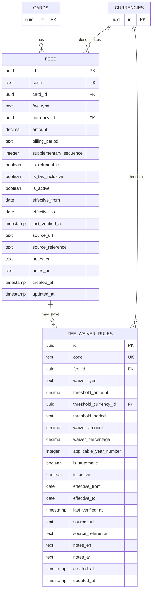

# Fees Entity Specification

## Document Information

| Field              | Value                                    |
| ------------------ | ---------------------------------------- |
| Project            | Credit Card Intelligence Platform (CCIP) |
| Component          | Fees                                     |
| Version            | 1.0                                      |
| Status             | Draft                                    |
| Architecture Scope | Recommendation Engine MVP                |
| Database Target    | PostgreSQL / Supabase                    |

---

# 1. Purpose

This document defines the MVP data model for card fees within the Credit Card Intelligence Platform.

The fees entity exists to support accurate net-value calculations without storing fee amounts directly inside the `cards` table.

The Recommendation Engine requires annual fees to calculate:

```text
Net Value

=

Annual Reward Value

−

Annual Card Cost
```

The model must also support fee waivers and supplementary-card fees while remaining extensible for future fee types.

---

# 2. Approved Architecture Decision

The project previously approved:

```text
DB-008

Fees must be stored in a separate entity.
```

Therefore:

```text
cards
```

must not contain fields such as:

```text
annual_fee
supplementary_card_fee
fee_waiver_threshold
```

All structured fee information belongs in the fees domain.

---

# 3. MVP Scope

The MVP supports the following fee types:

```text
ANNUAL_PRIMARY_CARD
ANNUAL_SUPPLEMENTARY_CARD
```

The MVP also supports fee waivers based on annual spending.

Examples:

```text
Annual fee: 500 SAR

Waived when annual spend reaches:
30,000 SAR
```

Advanced operational fees are deferred.

---

# 4. Recommended Tables

The MVP fees domain uses two tables:

```text
fees
fee_waiver_rules
```

---

## 4.1 Fees

Stores one fee definition for one card.

Table:

```text
fees
```

---

## 4.2 Fee Waiver Rules

Stores conditions that may reduce or waive a fee.

Table:

```text
fee_waiver_rules
```

Separating waiver conditions from the fee record avoids placing conditional business logic into a single overloaded row.

---

# 5. Fees Table

## Table Name

```text
fees
```

---

## Purpose

The table stores structured charges associated with a card.

Each fee record represents one independently identifiable fee.

Examples:

```text
Al Rajhi Card Annual Primary Fee

Al Rajhi Card Annual Supplementary Fee
```

---

# 6. Fees Fields

| Field                    | Type        | Required | Description                                    |
| ------------------------ | ----------- | -------: | ---------------------------------------------- |
| `id`                     | UUID        |      Yes | Internal primary key                           |
| `code`                   | Text        |      Yes | Stable business identifier                     |
| `card_id`                | UUID        |      Yes | Related card                                   |
| `fee_type`               | Text / Enum |      Yes | Controlled fee classification                  |
| `currency_id`            | UUID        |      Yes | Currency of the fee                            |
| `amount`                 | Decimal     |      Yes | Monetary fee amount                            |
| `billing_period`         | Text / Enum |      Yes | How often the fee is charged                   |
| `supplementary_sequence` | Integer     |       No | Supplementary-card position if pricing differs |
| `is_refundable`          | Boolean     |      Yes | Whether the fee may be refunded                |
| `is_tax_inclusive`       | Boolean     |      Yes | Whether the amount includes applicable tax     |
| `is_active`              | Boolean     |      Yes | Whether the fee is currently valid             |
| `effective_from`         | Date        |      Yes | Date the current fee became effective          |
| `effective_to`           | Date        |       No | Optional expiry date                           |
| `last_verified_at`       | Timestamp   |      Yes | Most recent verification date                  |
| `source_url`             | Text        |      Yes | Official source URL                            |
| `source_reference`       | Text        |       No | Page, section, tariff reference, or note       |
| `notes_en`               | Text        |       No | English administrative notes                   |
| `notes_ar`               | Text        |       No | Arabic administrative notes                    |
| `created_at`             | Timestamp   |      Yes | Record creation timestamp                      |
| `updated_at`             | Timestamp   |      Yes | Record update timestamp                        |

---

# 7. Field Definitions

## id

Internal UUID primary key.

Recommended PostgreSQL default:

```sql
gen_random_uuid()
```

---

## code

Stable business identifier.

Example:

```text
ALRAJHI_ALFURSAN_VISA_INFINITE_ANNUAL_PRIMARY
```

The code must remain stable even when display names or fee amounts change.

---

## card_id

Foreign key to:

```text
cards.id
```

Every fee must belong to exactly one card.

Relationship:

```text
cards 1 ─── N fees
```

---

## fee_type

Controlled classification of the fee.

MVP values:

```text
ANNUAL_PRIMARY_CARD
ANNUAL_SUPPLEMENTARY_CARD
```

Future values may include:

```text
FOREIGN_TRANSACTION
CASH_ADVANCE
LATE_PAYMENT
OVER_LIMIT
CARD_REPLACEMENT
BALANCE_TRANSFER
INSTALLMENT_PROCESSING
```

Future fee types must not require redesigning the table.

---

## currency_id

Foreign key to:

```text
currencies.id
```

The fee currency is explicitly stored.

No SAR assumption is allowed at the database level.

---

## amount

The monetary amount charged.

Examples:

```text
0.00
500.00
1,000.00
```

Rules:

```text
amount >= 0
```

A zero amount is valid for cards with no annual fee.

---

## billing_period

Defines the fee recurrence.

MVP values:

```text
ONE_TIME
MONTHLY
QUARTERLY
ANNUAL
```

For annual card fees:

```text
billing_period = ANNUAL
```

The Recommendation Engine must normalize recurring fees into annual cost.

---

## supplementary_sequence

Optional field used when supplementary cards have different pricing by sequence.

Examples:

```text
First supplementary card: free
Second supplementary card: 100 SAR
```

Possible values:

```text
1
2
3
```

For a general supplementary-card fee applying to all supplementary cards:

```text
supplementary_sequence = NULL
```

For primary-card fees:

```text
supplementary_sequence = NULL
```

---

## is_refundable

Indicates whether the fee may be refunded under official card terms.

MVP default:

```text
false
```

Refund conditions themselves are deferred unless represented through a waiver rule.

---

## is_tax_inclusive

Indicates whether the recorded amount includes tax.

This field prevents ambiguity when official sources display:

```text
Fee excluding VAT
```

or:

```text
Fee including VAT
```

The MVP stores the official published amount and its tax treatment.

---

## is_active

Indicates whether the fee is currently valid.

Default:

```text
true
```

Inactive fees remain stored for administrative traceability but are ignored by the Recommendation Engine.

---

## effective_from

Date the fee became valid.

Required because the project uses a current-state model with explicit effective dates.

---

## effective_to

Optional expiry date.

A fee is currently effective when:

```text
effective_from <= calculation_date
```

and:

```text
effective_to IS NULL
OR
effective_to >= calculation_date
```

The current-state MVP should normally deactivate or replace outdated records.

---

## last_verified_at

Timestamp of the latest verification against an official source.

Fees with stale verification may reduce recommendation confidence.

---

## source_url

Official source used to verify the fee.

Examples:

```text
Official bank card page
Official tariff guide
Official terms and conditions PDF
```

Third-party comparison websites must not be treated as authoritative sources.

---

## source_reference

Optional reference to the exact source location.

Examples:

```text
Tariff Guide, Page 12

Fees and Charges Section

Card Terms, Clause 4.2
```

---

# 8. Fee Waiver Rules Table

## Table Name

```text
fee_waiver_rules
```

---

## Purpose

Stores structured conditions under which a fee may be waived or reduced.

Examples:

```text
Annual fee waived when annual spend reaches 30,000 SAR
```

```text
First year annual fee waived
```

```text
50% fee reduction after spending 20,000 SAR
```

---

# 9. Fee Waiver Rule Fields

| Field                    | Type        | Required | Description                           |
| ------------------------ | ----------- | -------: | ------------------------------------- |
| `id`                     | UUID        |      Yes | Internal primary key                  |
| `code`                   | Text        |      Yes | Stable business identifier            |
| `fee_id`                 | UUID        |      Yes | Fee affected by the rule              |
| `waiver_type`            | Text / Enum |      Yes | Type of waiver                        |
| `threshold_amount`       | Decimal     |       No | Required spending threshold           |
| `threshold_currency_id`  | UUID        |       No | Currency of the threshold             |
| `threshold_period`       | Text / Enum |       No | Period used to evaluate spending      |
| `waiver_amount`          | Decimal     |       No | Fixed amount waived                   |
| `waiver_percentage`      | Decimal     |       No | Percentage of fee waived              |
| `applicable_year_number` | Integer     |       No | Membership year to which rule applies |
| `is_automatic`           | Boolean     |      Yes | Whether waiver occurs automatically   |
| `is_active`              | Boolean     |      Yes | Whether rule is currently valid       |
| `effective_from`         | Date        |      Yes | Start date                            |
| `effective_to`           | Date        |       No | End date                              |
| `last_verified_at`       | Timestamp   |      Yes | Verification timestamp                |
| `source_url`             | Text        |      Yes | Official source                       |
| `source_reference`       | Text        |       No | Exact source reference                |
| `notes_en`               | Text        |       No | English notes                         |
| `notes_ar`               | Text        |       No | Arabic notes                          |
| `created_at`             | Timestamp   |      Yes | Record creation timestamp             |
| `updated_at`             | Timestamp   |      Yes | Record update timestamp               |

---

# 10. Waiver Types

MVP values:

```text
SPEND_THRESHOLD
FIRST_YEAR
FULL_WAIVER
PARTIAL_FIXED
PARTIAL_PERCENTAGE
```

---

## SPEND_THRESHOLD

Fee waiver depends on eligible spending.

Example:

```text
Annual spend >= 30,000 SAR
```

---

## FIRST_YEAR

The fee is waived during the first membership year.

Example:

```text
First year free
```

---

## FULL_WAIVER

Fee is fully waived under the stated condition.

This may be combined with a threshold or eligibility rule.

---

## PARTIAL_FIXED

A fixed monetary amount is deducted.

Example:

```text
500 SAR fee

100 SAR waived
```

---

## PARTIAL_PERCENTAGE

A percentage of the fee is waived.

Example:

```text
50% annual fee waiver
```

---

# 11. Fee Waiver Field Definitions

## fee_id

Foreign key to:

```text
fees.id
```

Relationship:

```text
fees 1 ─── N fee_waiver_rules
```

A fee may have zero or multiple waiver rules.

---

## threshold_amount

Minimum eligible spending required.

Example:

```text
30,000.00
```

Required when:

```text
waiver_type = SPEND_THRESHOLD
```

---

## threshold_currency_id

Currency used for the spending threshold.

Foreign key to:

```text
currencies.id
```

Required when `threshold_amount` is provided.

---

## threshold_period

Period over which spending is evaluated.

MVP values:

```text
MONTHLY
STATEMENT_CYCLE
CARD_MEMBERSHIP_YEAR
CALENDAR_YEAR
```

For annual fee waiver calculations, the preferred value is:

```text
CARD_MEMBERSHIP_YEAR
```

If the official source does not clearly distinguish membership year from calendar year, the record must not make an unsupported assumption.

---

## waiver_amount

Fixed monetary reduction.

Used with:

```text
PARTIAL_FIXED
```

Constraint:

```text
waiver_amount >= 0
```

The final waived amount must not exceed the fee amount unless an official refund rule explicitly permits it.

---

## waiver_percentage

Percentage reduction.

Used with:

```text
PARTIAL_PERCENTAGE
```

Constraint:

```text
0 < waiver_percentage <= 100
```

A full percentage waiver may use:

```text
100
```

---

## applicable_year_number

Optional card-membership year.

Examples:

```text
1 = first membership year
2 = second membership year
```

For:

```text
FIRST_YEAR
```

the recommended value is:

```text
1
```

---

## is_automatic

Indicates whether the bank applies the waiver automatically.

Examples:

```text
true
```

when the bank automatically waives the fee after reaching the threshold.

```text
false
```

when the customer must contact the bank or submit a request.

For recommendation calculations, non-automatic waivers must be disclosed in the explanation.

---

# 12. Relationships

```text
cards
└── fees
    └── fee_waiver_rules
```

Additional references:

```text
currencies
├── fees
└── fee_waiver_rules
```

---

# 13. Mermaid ERD Extension



---

# 14. Required Constraints

## Fee Amount

```text
amount >= 0
```

---

## Supplementary Sequence

```text
supplementary_sequence IS NULL
OR
supplementary_sequence >= 1
```

---

## Effective Date Range

```text
effective_to IS NULL
OR
effective_to >= effective_from
```

---

## Waiver Percentage

```text
waiver_percentage IS NULL
OR
(
    waiver_percentage > 0
    AND
    waiver_percentage <= 100
)
```

---

## Waiver Amount

```text
waiver_amount IS NULL
OR
waiver_amount >= 0
```

---

## Threshold Amount

```text
threshold_amount IS NULL
OR
threshold_amount >= 0
```

---

# 15. Conditional Waiver Constraints

## Spend Threshold

When:

```text
waiver_type = SPEND_THRESHOLD
```

the following must be present:

```text
threshold_amount
threshold_currency_id
threshold_period
```

---

## Partial Fixed Waiver

When:

```text
waiver_type = PARTIAL_FIXED
```

the following must be present:

```text
waiver_amount
```

and:

```text
waiver_percentage IS NULL
```

---

## Partial Percentage Waiver

When:

```text
waiver_type = PARTIAL_PERCENTAGE
```

the following must be present:

```text
waiver_percentage
```

and:

```text
waiver_amount IS NULL
```

---

## First-Year Waiver

When:

```text
waiver_type = FIRST_YEAR
```

recommended validation:

```text
applicable_year_number = 1
```

---

# 16. Uniqueness Constraints

Recommended unique fields:

```text
fees.code

fee_waiver_rules.code
```

Recommended fee uniqueness:

```text
card_id
fee_type
supplementary_sequence
effective_from
```

This allows fee changes over time while reducing accidental duplicate active records.

Because `NULL` values require careful handling in PostgreSQL unique constraints, implementation may use:

```text
COALESCE(supplementary_sequence, 0)
```

through a unique expression index.

---

# 17. Recommended Indexes

## Fees

```text
fees.card_id
fees.fee_type
fees.currency_id
fees.is_active
fees.effective_from
fees.effective_to
```

Recommended composite index:

```text
card_id
fee_type
is_active
effective_from
effective_to
```

---

## Fee Waiver Rules

```text
fee_waiver_rules.fee_id
fee_waiver_rules.waiver_type
fee_waiver_rules.is_active
fee_waiver_rules.effective_from
fee_waiver_rules.effective_to
```

Recommended composite index:

```text
fee_id
is_active
effective_from
effective_to
```

---

# 18. Foreign Key Behavior

## Card to Fees

```text
fees.card_id
REFERENCES cards(id)
ON DELETE RESTRICT
```

A card with fee records should normally be deactivated instead of deleted.

---

## Currency to Fees

```text
fees.currency_id
REFERENCES currencies(id)
ON DELETE RESTRICT
```

---

## Fee to Waiver Rules

```text
fee_waiver_rules.fee_id
REFERENCES fees(id)
ON DELETE CASCADE
```

Waiver rules have no independent meaning after their parent fee is removed.

---

## Threshold Currency

```text
fee_waiver_rules.threshold_currency_id
REFERENCES currencies(id)
ON DELETE RESTRICT
```

---

# 19. Default Values

Recommended defaults:

```text
fees.billing_period = ANNUAL
fees.is_refundable = false
fees.is_tax_inclusive = true
fees.is_active = true
fees.effective_from = CURRENT_DATE
```

```text
fee_waiver_rules.is_automatic = true
fee_waiver_rules.is_active = true
fee_waiver_rules.effective_from = CURRENT_DATE
```

Source and verification fields should not receive artificial defaults.

They must be entered from verified official data.

---

# 20. Recommendation Engine Fee Calculation

The Recommendation Engine must calculate annual card cost using active and effective fees.

---

## Step 1 — Load Primary Annual Fee

Load the active fee where:

```text
fee_type = ANNUAL_PRIMARY_CARD
```

and:

```text
is_active = true
```

and the fee is effective on the calculation date.

---

## Step 2 — Normalize Billing Period

```text
ONE_TIME
```

One-time fees must not automatically be included in recurring annual net value unless the recommendation scenario explicitly includes acquisition-year costs.

```text
MONTHLY
```

Formula:

```text
Annualized Fee = Amount × 12
```

```text
QUARTERLY
```

Formula:

```text
Annualized Fee = Amount × 4
```

```text
ANNUAL
```

Formula:

```text
Annualized Fee = Amount
```

---

## Step 3 — Evaluate Waiver Rules

For each active waiver rule:

1. Confirm the rule is effective.
2. Confirm the spending threshold is satisfied.
3. Confirm the membership year condition.
4. Determine whether the waiver is automatic.
5. Calculate the applicable reduction.

---

## Step 4 — Calculate Net Annual Fee

Formula:

```text
Net Annual Fee

=

Annualized Primary Fee

−

Applicable Waiver
```

Constraint:

```text
Net Annual Fee >= 0
```

---

# 21. MVP Fee Scenarios

## Scenario A — Standard Annual Fee

```text
Annual Fee:
500 SAR

Waiver:
None
```

Result:

```text
Annual Card Cost:
500 SAR
```

---

## Scenario B — Zero Annual Fee

```text
Annual Fee:
0 SAR
```

Result:

```text
Annual Card Cost:
0 SAR
```

A zero-value fee row is preferred when the official product explicitly states that no annual fee applies.

This distinguishes:

```text
Confirmed zero fee
```

from:

```text
Fee data missing
```

---

## Scenario C — Spend-Based Full Waiver

```text
Annual Fee:
500 SAR

Annual Spend Threshold:
30,000 SAR

User Annual Spend:
40,000 SAR
```

Result:

```text
Applicable Fee:
0 SAR
```

---

## Scenario D — Spend Threshold Not Met

```text
Annual Fee:
500 SAR

Annual Spend Threshold:
30,000 SAR

User Annual Spend:
20,000 SAR
```

Result:

```text
Applicable Fee:
500 SAR
```

---

## Scenario E — First Year Free

```text
Annual Fee:
1,000 SAR

Waiver Type:
FIRST_YEAR
```

Acquisition-year result:

```text
Applicable Fee:
0 SAR
```

Ongoing-year result:

```text
Applicable Fee:
1,000 SAR
```

The Recommendation Engine must clearly distinguish first-year value from ongoing annual value when this feature is enabled.

---

## Scenario F — Partial Waiver

```text
Annual Fee:
800 SAR

Waiver Percentage:
50%
```

Result:

```text
Applicable Fee:
400 SAR
```

---

# 22. First-Year Versus Ongoing Value

Some cards offer:

```text
First year free
```

but charge fees in subsequent years.

The MVP recommendation output should eventually support:

```text
First-Year Net Value
```

and:

```text
Ongoing Annual Net Value
```

Until this distinction is implemented, the primary ranking should use:

```text
Ongoing Annual Net Value
```

because it provides a more sustainable comparison.

A first-year waiver may be displayed as an additional benefit but must not permanently distort the recurring-value ranking.

---

# 23. Supplementary Card Fees

Supplementary fees are stored because they are relevant for future household and family-use scenarios.

However, the standard single-user Recommendation Engine MVP will not include supplementary-card fees unless the user explicitly requests supplementary cards.

Default recommendation calculation:

```text
Primary annual fee only
```

Future input:

```text
Number of supplementary cards
```

Future formula:

```text
Total Annual Card Cost

=

Primary Annual Fee

+

Applicable Supplementary Fees
```

---

# 24. Missing Fee Data

The engine must distinguish three cases.

## Confirmed Zero Fee

```text
Fee record exists
amount = 0
```

Meaning:

```text
Officially no annual fee
```

---

## Known Paid Fee

```text
Fee record exists
amount > 0
```

---

## Missing Fee Information

```text
No applicable fee record
```

The engine must not assume that missing fee data means zero.

Recommended behavior:

```text
Exclude card from final recommendation ranking
```

or:

```text
Include with LOW confidence and an explicit warning
```

Preferred MVP production rule:

```text
A card must have a verified primary annual fee record to be recommendation-eligible.
```

---

# 25. Recommendation Eligibility Impact

A card may satisfy:

```text
cards.is_recommendation_eligible = true
```

but still fail runtime data completeness checks.

Required fee completeness:

```text
One active and effective
ANNUAL_PRIMARY_CARD fee record
```

The amount may be zero.

If the record is missing:

```text
Fee Data Status = INCOMPLETE
```

and the card should not receive a normal ranked result.

---

# 26. Recommendation Explanation Examples

## No Annual Fee

```text
No annual fee, so all estimated rewards contribute directly to net value.
```

---

## Fee Recovered by Rewards

```text
The estimated annual rewards exceed the 500 SAR annual fee by 1,300 SAR.
```

---

## Fee Waiver Achieved

```text
Your estimated annual spending exceeds the 30,000 SAR waiver threshold, reducing the annual fee to zero.
```

---

## Fee Waiver Not Achieved

```text
Your estimated annual spending is 8,000 SAR below the annual fee waiver threshold.
```

---

## Non-Automatic Waiver

```text
The annual fee may be waived, but the bank may require you to request the waiver.
```

---

# 27. Example Records

## Primary Annual Fee

```text
code:
ALRAJHI_ALFURSAN_VISA_INFINITE_ANNUAL_PRIMARY

card_id:
Al Rajhi AlFursan Visa Infinite

fee_type:
ANNUAL_PRIMARY_CARD

currency:
SAR

amount:
1000.00

billing_period:
ANNUAL

is_refundable:
false

is_tax_inclusive:
true

is_active:
true
```

---

## Spending-Based Waiver

```text
code:
ALRAJHI_ALFURSAN_VISA_INFINITE_ANNUAL_SPEND_WAIVER

fee:
Primary Annual Fee

waiver_type:
SPEND_THRESHOLD

threshold_amount:
100000.00

threshold_currency:
SAR

threshold_period:
CARD_MEMBERSHIP_YEAR

waiver_percentage:
100

is_automatic:
true

is_active:
true
```

---

## First Supplementary Card Free

```text
fee_type:
ANNUAL_SUPPLEMENTARY_CARD

supplementary_sequence:
1

amount:
0.00

billing_period:
ANNUAL
```

---

# 28. Admin Validation Rules

The Admin Panel must prevent publishing fee data when:

```text
card_id is missing
fee_type is missing
currency is missing
amount is missing
source_url is missing
last_verified_at is missing
effective_from is missing
```

The Admin Panel must warn when:

```text
A card has no primary annual fee
Multiple active primary annual fees overlap
A fee source is stale
A waiver threshold has no currency
A partial waiver has no amount or percentage
```

---

# 29. Data Quality Rules

## Official Data Only

Fee information must originate from:

```text
Official bank website
Official fee tariff
Official card terms
Official product disclosure
```

---

## No Assumed VAT Treatment

If the source does not specify whether tax is included:

```text
is_tax_inclusive
```

must not be guessed.

The record should be flagged for review.

---

## No Missing-as-Zero Logic

Absence of fee data must never be interpreted as:

```text
0 SAR
```

---

## Current-State Consistency

Only one active and effective primary annual fee should apply to a card at a specific point in time.

Overlapping records must be blocked or flagged.

---

# 30. Deferred Features

Not included in the MVP implementation:

```text
Foreign transaction fees
Cash advance fees
Late payment fees
Over-limit fees
Card replacement fees
Balance transfer fees
Installment fees
Merchant-specific fees
Tax calculation engine
Fee history and version tables
Customer-specific negotiated fees
Bank relationship discounts
Payroll-customer exemptions
Salary-transfer exemptions
Subscription-based fee waivers
Complex multi-condition waivers
```

These can use the same `fees` table with future rule extensions.

---

# 31. Required ERD v1 Update

The master ERD must be updated in a future revision to include:

```text
cards 1 ─── N fees

fees 1 ─── N fee_waiver_rules

currencies 1 ─── N fees

currencies 1 ─── N fee_waiver_rules
```

Recommended next ERD version:

```text
ERD v1.1
```

However, the project may proceed directly to PostgreSQL schema design as long as the fees domain is included in the implementation specification.

---

# 32. Architecture Decisions

## FEE-001

Fee data must be stored separately from cards.

---

## FEE-002

Each fee is associated with exactly one issued card variant.

---

## FEE-003

A zero-fee product must use an explicit zero-value fee record.

---

## FEE-004

Missing fee data must not be treated as zero.

---

## FEE-005

Fee waiver conditions are stored separately from fee records.

---

## FEE-006

The Recommendation Engine uses ongoing annual fees for the primary recurring-value ranking.

---

## FEE-007

First-year fee waivers may be shown separately but must not distort ongoing annual ranking.

---

## FEE-008

Supplementary-card fees are excluded from standard MVP calculations unless supplementary cards are requested.

---

## FEE-009

A verified primary annual fee record is required for production recommendation eligibility.

---

# 33. Final Architecture Summary

```text
CARD
 │
 └── FEE
      │
      ├── Fee Type
      ├── Amount
      ├── Currency
      ├── Billing Period
      ├── Effective Dates
      ├── Verification Source
      │
      └── FEE WAIVER RULE
           ├── Spend Threshold
           ├── Threshold Period
           ├── Fixed Waiver
           ├── Percentage Waiver
           ├── Membership Year
           └── Automatic / Manual
```

The fees model provides the minimum structured data required to calculate reliable annual card net value while preserving the approved separation between card identity and financial charges.
